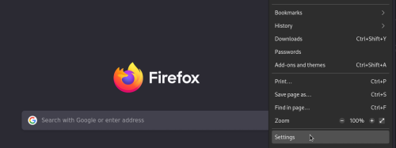
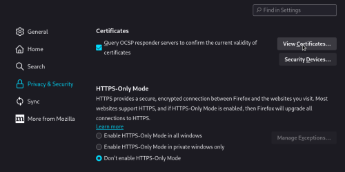
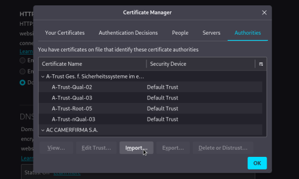
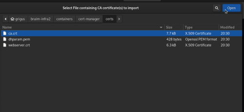
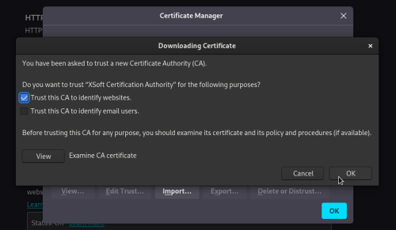
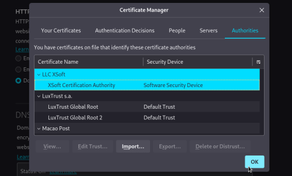
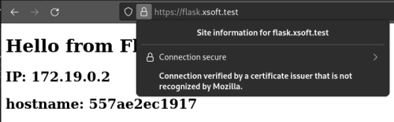

# Инструкция по запуску

## Развертываем инфраструктуру

Пу-пу-пу...

```bash
docker compose up -d
```
Генерация ключа для протокола Диффи-Хеллмана может занять некоторое время, и до её окончания контейнер с веб-сервером не запустится!

## Подготовливаем окружения на хосте

Так как сертификат веб-сервера у нас самоподписанный, придется немного извратиться и записать наш УЦ в корневые доверенные, параллельно рассказав /etc/hosts про доменное имя. Это в принципе все, чем занимается нижепредставленный скрипт. (А ещё проверяет, запущен ли он на Debian-подобном дистрибутиве... Ну просто на всякий случай!)

```bash
chmod +x register_ca_and_host.sh
sudo ./register_ca_and_host.sh
```

Стоит оговориться, я исходил из предположения, что инфраструктура будет развернута непосредсвенно на хосте, а не внутри ВМ. Если запрашивать защищенное подключение у 192.168.Х.Х, страничка конечно откроется, но попытается предупредить, что в сертификате подобный адрес не упоминается.

### Пару слов про Firefox

Конкретно на системе Debian браузер Firefox не обновляет базу доверенных УЦ автоматически после прогона скрипта. У них, как оказалось, в принципе своя база, и добавлять сертификат туда придется ручками!

#### Шаг 1



#### Шаг 2



#### Шаг 3



#### Шаг 4



#### Шаг 5



#### Шаг 6



## Проверяем!

Веб-сервер будет доступен по протоколам HTTP/HTTPS на адресах:

```
flask.xsoft.test
localhost
127.0.0.1
```

На ваш выбор!)



## Завершение работы

